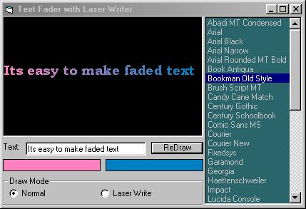



## Laser Text Fader

### Description

Based on my earlier Laser Writer, now you can write text with a laser effect, choose the font, and fade the text pixel by pixel. Check out the screenshot!
 
### More Info
 

             |
---                |---
**Submitted On**   |2000-06-16 13:47:32
**By**             |[Nick Smith](https://github.com/Planet-Source-Code/PSCIndex/blob/master/ByAuthor/nick-smith.md)
**Level**          |Intermediate
**User Rating**    |4.3 (26 globes from 6 users)
**Compatibility**  |VB 4\.0 \(16\-bit\), VB 4\.0 \(32\-bit\), VB 5\.0, VB 6\.0
**Category**       |[Custom Controls/ Forms/  Menus](https://github.com/Planet-Source-Code/PSCIndex/blob/master/ByCategory/custom-controls-forms-menus__1-4.md)
**World**          |[Visual Basic](https://github.com/Planet-Source-Code/PSCIndex/blob/master/ByWorld/visual-basic.md)
**Archive File**   |[CODE\_UPLOAD67816142000\.zip](https://github.com/Planet-Source-Code/nick-smith-laser-text-fader__1-8931/archive/master.zip)

### API Declarations

see .bas file

